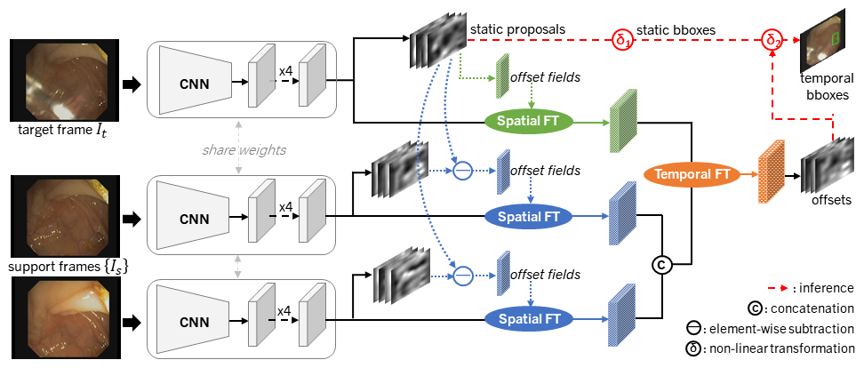

# STFT: Spatial-Temporal Feature Transformation

By [Lingyun Wu](https://scholar.google.com/citations?user=WmAYPtkAAAAJ&hl=en), [Zhiqiang Hu](https://scholar.google.com/citations?hl=en&user=n8E_lV8AAAAJ), [Yuanfeng Ji](https://scholar.google.com/citations?hl=en&user=7HGv1bkAAAAJ), [Ping Luo](https://scholar.google.com/citations?user=aXdjxb4AAAAJ&hl=en), [Shaoting Zhang](https://scholar.google.com/citations?hl=en&user=oiBMWK4AAAAJ).

This repo is an PyTorch implementation of "Multi-frame Collaboration for Effective Endoscopic Video Polyp Detection via Spatial-Temporal Feature Transformation", accepted by MICCAI 2021. 

<!-- This repo is an PyTorch implementation of ["Multi-frame Collaboration for Effective Endoscopic Video Polyp Detection via Spatial-Temporal Feature Transformation"](), accepted by MICCAI 2021.  -->

<!-- This repository contains the implementation of our approach STFT and several other algorithms like [FGFA](http://openaccess.thecvf.com/content_iccv_2017/html/Zhu_Flow-Guided_Feature_Aggregation_ICCV_2017_paper.html), [RDN](https://arxiv.org/abs/1908.09511), and [MEGA](https://arxiv.org/abs/2003.12063) based on [mega.pytorch](https://github.com/Scalsol/mega.pytorch), as well as some pretrained models to reproduce the results on Endoscopic Video Datasets and ImageNetVID reported in our paper. 

 -->
## News

<!-- - [2021/08/30] Implementation for image-based SOTA methods (e.g., FCOS, RetinaNet, BorderDet) will be updated.
- [2021/08/17] Demo for visualization will be added.
- [2021/08/14] Results on ImageNetVID will be added.
- [2021/07/28] Implementation for more video-based SOTA methods (e.g., FGFA, RDN, MEGA) released. -->
<!-- - [2021/07/10] Release training/testing scripts and pretrained models for STFT. -->
- Training/Testing scripts and pretrained models for STFT will be released.
- [2021/06/29] Create repository.

## Main Results

Pretrained models will be available at Google Drive.

## Contributing to the project
Any pull requests or issues are welcomed.
